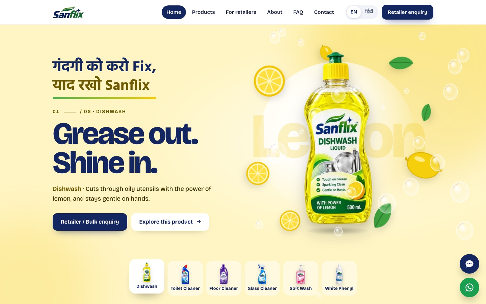
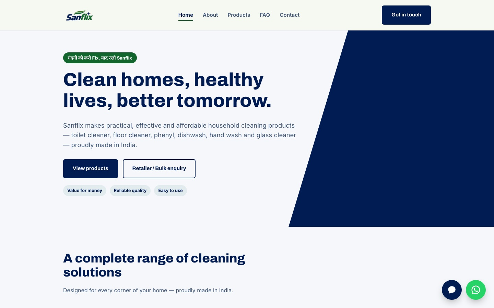
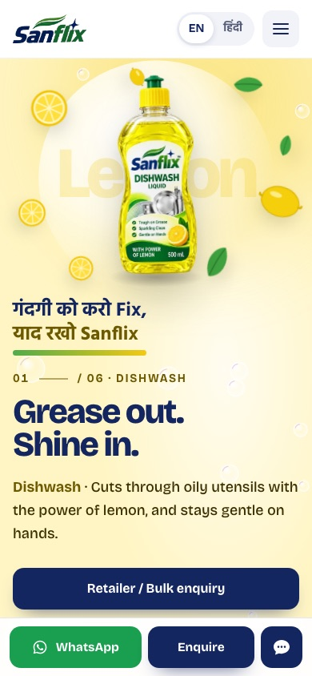

# Sanflix — Website

**Live site: [sanflix.in](https://sanflix.in)**

A bilingual (English / Hindi), mobile-first business website for **Sanflix**, a household cleaning products brand made in India by Kedar Consumer Products. This was a real client project: the site's main job is to help shop owners, distributors and bulk buyers find the brand and get in touch easily, mostly from budget Android phones.



---

## The problem

Sanflix sells six everyday cleaning products (toilet cleaner, floor cleaner, dishwash, glass cleaner, hand wash and white phenyl) through local shops. The first version of the site went live on 24 September 2026. It worked, but it looked like a generic template:

- No product imagery at the top of the home page
- The bright pack colours weren't used anywhere
- No dedicated path for retailers and distributors, the client's main business goal
- Heavy, unoptimised images on a site whose visitors mostly use slower mobile connections

So I redesigned and rebuilt it.

| Before | After |
|---|---|
|  |  |

---

## Features

- **Product "scenes" on the home page.** Each of the six products has its own colour theme taken from its packaging. As the page cycles through the range, the background, headline and floating ingredients change (lemons for dishwash, rose petals for hand wash, water droplets for glass cleaner…). The bottle tilts in 3D with the mouse or the phone's tilt, and soap bubbles drift up and pop on touch.
- **"Wipe clean" interaction.** Visitors wipe a smudged glass panel with a finger or mouse to reveal the product range. A "Clean it for me" button makes it accessible by keyboard.
- **English / Hindi switch** on every page. The choice is remembered per visitor and applied before the page renders, so there's no flash of the wrong language.
- **Retailer and distributor page** with an enquiry form that adapts to the type of enquiry (household, retailer, distributor, bulk/institutional) and can be pre-filled from product pages.
- **Mobile action bar** with WhatsApp, Enquire and chat always one tap away.
- **Chat assistant.** A lightweight keyword-based assistant that answers common questions (products, prices, pack sizes, availability) in English, Hindi and Hinglish.
- **Six product sections**, each with benefits, pack sizes, an enquiry button and a pre-filled WhatsApp link.

<p align="center"></p>

---

## Performance, accessibility and SEO

- **Home page download cut to less than half** of the previous version (about 800 KB down to about 300 KB) by converting images to WebP, cutting product bottles out onto transparent backgrounds, resizing the logo (270 KB down to 16 KB) and lazy-loading everything below the fold.
- **Tested on every page at 6 screen widths** (320, 390, 768, 1024, 1440 and 1920 px): no horizontal scrolling and no console errors.
- **Accessible:** keyboard navigation, visible focus states, readable contrast, proper labels, and all animation switched off for visitors who use "reduce motion".
- Animations pause when off-screen or when the tab is hidden, to save battery on phones.
- **SEO:** page titles and descriptions, canonical links, `sitemap.xml`, `robots.txt`, Open Graph share image, and schema.org structured data (Organization and FAQPage).
- **Honest claims:** only product claims the brand can back up are used, in line with Indian advertising rules.

---

## Tech stack

- **HTML, CSS and vanilla JavaScript.** No frameworks and no build step.
- **Canvas API** for the soap bubbles and the wipe-clean effect
- **Formspree** for enquiry form submissions
- **Google Analytics 4**, including custom events for enquiries
- **Netlify** hosting with automatic deploys from this repository, on a custom domain
- **Google Fonts:** Bricolage Grotesque (English) and Hind (Devanagari)

---

## Project structure

```
├── index.html          Home page (product scenes, range, wipe-clean, values)
├── products.html       One section per product
├── retailers.html      For retailers, distributors and bulk buyers
├── about.html
├── faq.html
├── contact.html        Enquiry form + contact details
├── privacy.html        Privacy policy (DPDP Act, 2023)
├── terms.html
├── 404.html
├── style.css           All styles; each product has a colour-theme class (.w-dishwash, .w-toilet…)
├── script.js           Language switch, hero scenes, wipe effect, form, chat assistant
├── assets/
│   ├── bottles/        Cut-out product bottles (WebP, transparent)
│   └── …               Logos, favicons, share image
├── sitemap.xml
└── robots.txt
```

**How the bilingual text works:** every piece of text is written in both languages, `<span class="t-en">…</span><span class="t-hi" lang="hi">…</span>`, and a `data-lang` attribute on `<html>` decides which one is shown.

---

## Run it locally

No installation needed. From the project folder:

```bash
python3 -m http.server 5173
```

Then open http://localhost:5173

---

## Deployment

Netlify deploys the `main` branch to [sanflix.in](https://sanflix.in).

---

Built by **Ankit Tyagi** for Kedar Consumer Products.
